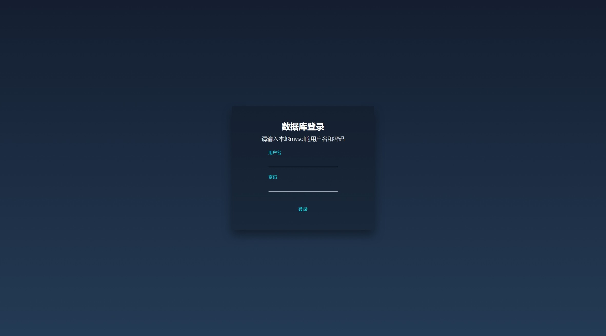

# 数据准备

## 原始数据获取

  在GitHub中下载得到all_star_relations_old.csv和star_infos_old.csv文件

## 数据处理

### baike_spider.py

  代码的主要思路是使用Selenium库和WebDriver来自动化操作浏览器，从百度图片搜索中，通过循环遍历明星名称，并在每个搜索结果页面中提取图片链接。然后将提取的图片链接保存到数据中，并将更新后的数据保存到CSV文件中。

### change_csv.py

  代码的主要思路是使用Pandas库读取CSV文件，使用循环遍历每一行数据，并通过正则表达式匹配提取出需要的信息。将原csv中的信息拆解为homeland、weight、birth三个信息，并通过字符串拼接的方式生成百度百科的链接，修改其baike.url列，最后再更新CSV文件。

# 数据库的实现

## MySQL

  该部分的目的是读取明星信息和关系数据文件，将数据存储到MySQL数据库中的明星表和关系表中，以下是具体的实现思路：

  1. 导入代码中所需要的库

  2. 建立与MySQL数据库的连接，并创建一个数据库的对象，之后使用SQL语句创建一个名为star_relation的数据库

  3. 创建一个名为"明星"的表，该表包含以下列：
     
     > id（主键，自增）
     >
     > name（明星姓名）
     >
     > image（明星图片链接）
     >
     > homeland（明星籍贯）
     >
     > weight（明星体重）
     >
     > birth（明星出生日期）
     >
     > baike_url（明星百科链接）
     
     使用iterrows方法读取包含明星相关信息的star_infos.csv的文件，对于每个明星，检查其出生日期是否有效，如果有效，构建插入明星数据的SQL语句，并执行插入操作；如果无效，构建不包含出生日期的SQL语句，并执行插入操作

  4. 共创建37个关系表，关系表的名称为关系类型，包含以下列：
     
     > id（主键，自增）
     >
     > star_subject_id（外键，指向明星表中的id）
     >
     > star_object_id（外键，指向明星表中的id）
     
     读取包含明星之间的关系数据的all_star_relations.csv文件，在关系数据文件中过滤出当前关系类型的数据，对于每条关系数据，根据明星姓名查询明星表获取对应的明星id，构建插入关系数据的SQL语句，并执行插入操作

  5. 提交所有数据库的操作，关闭数据库的连接

  ## Neo4j

  该部分的目的是将明星信息和关系数据存储到Neo4j数据库中的节点和关系中，以下是具体的实现思路：

  1. 导入代码中所需要的库
  2. 创建一个Graph对象，用于与Neo4j数据库建立连接，连接的URL为'bolt://localhost:7687'，用户名和密码分别为'neo4j'和'12345678'
  3. 读取"star_infos.csv"的文件，将明星的相关信息存储到node_stars的节点中，循环遍历该节点，对于每个明星，创建一个Node对象，并设置标签为"明星"，属性为
     
     > name
     >
     > image
     >
     > homeland
     >
     > weight
     >
     > birth
     >
     > baike_url
     
     并将节点添加到数据库中，对应的Node对象存储到`node`字典中
  4. 继续读取"all_star_relations.csv"的文件，将明星之间的关系存储到path_stars中，遍历每行数据，根据关系数据中的主体和客体明星名称，在`nodes`字典中找到对应的Node对象，创建表示两个明星之间的关系一个Relationship对象，并将该对象添加到数据库中

  # 拓展——可视化web设计说明

  ## 基础内容

  项目名称：明星关系数据库

  数据库类型：mysql数据库

  截图:

  

## 数据库登录

`/mysql/login`

在本地运行时，可以登录本地的mysql数据库

截图：

  ## 主页介绍

  ### 新建数据库

  `/mysql/new`

  删除原本的数据库`star-relation`，并重新创建一个同名的新数据库

  截图：

  

  ### 数据库修改

`/mysql/modify`

操作：添加、删除

表：明星、关系

每次切换选项或者输入框失去焦点都会通过ajax请求更新预览文本和提交按钮

  - 添加
    
    - 明星
      
      - 姓名
      
      - 祖籍
      
      - 出生日期
      
      - 体重
      
      截图：
      
      
    
    - 关系
      
      - 关系选择
      
      - 明星1
      
      - 明星2
      
      截图：
      
      

  - 删除
    
    - 明星
      
      - 姓名
      
      截图：
      
      
    
    - 关系
      
      - 关系
      
      - 明星1
      
      - 明星2
      
      截图：
      
      

  ### 数据库查询

  查询与所选节点有关的所有关系

  截图：

  

  具体功能：

  - 选择明星节点后点击`添加节点` 可以将明星添加到候选栏中，并更新右侧区域

  - `删除节点` 可以将明星从候选栏中移除，并更新右侧区域

  - 右侧显示区域将所选明星以及与其具有关系的节点显示出来，并且节点之间用双箭头相连接，箭头中间会标识出二者之间的关系

  # 拓展——MySQL复杂查询的实现

1. 连接mysql数据库
2. 获取输入明星姓名
3. 查询操作
   + 先查询所有表的名称，得到所有的关系
   + 遍历每张表，查询与该明星的所有有关的明星id
   + 查询明星表，得到各个id对应的明星姓名
   + 遍历每张表，查询与获得的明星有关的所有关系

  # 拓展——Neo4j复杂查询的实现

  1. 连接到Neo4j数据库：
     - 使用`Graph`类创建一个`Graph`对象。
     - 通过指定Neo4j数据库的URI和身份验证信息（用户名和密码）建立与数据库的连接。
  2. 定义`find_related_relationships`函数：
     - 该函数接受一个节点名称作为输入参数，用于指定要查找相关关系的节点。
     - 构建Cypher查询语句：
       - 使用`MATCH`子句匹配与给定节点相关的关系。
       - 使用`RETURN`子句返回关系及对方节点的名称。
     - 执行查询并获取结果：
       - 使用`graph.run()`方法执行查询。
       - 获取查询结果，其中包含关系和对方节点名称的信息。
     - 提取结果中的关系和对方姓名：
       - 遍历查询结果。
       - 从每个记录中提取关系和对方姓名，并将它们作为元组添加到`relationships`列表中。
     - 返回`relationships`列表作为函数的结果。
  3. 主程序流程：
     - 通过用户输入获取节点名称。
     - 调用`find_related_relationships`函数查找与该节点相关的关系。
     - 如果找到相关的关系
       - 打印节点名称。
       - 对于每个关系，打印关系的详细信息，包括关系本身和对方节点的姓名。
     - 如果没有找到相关的关系
       - 打印相应的提示信息。
